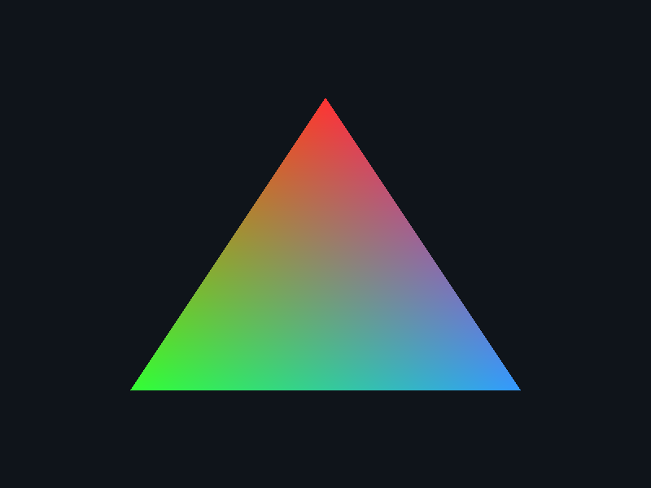
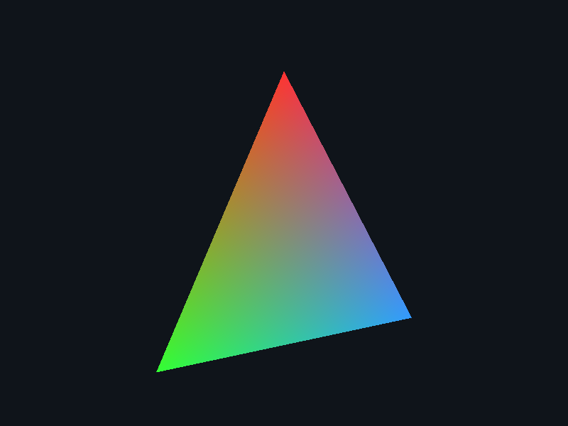
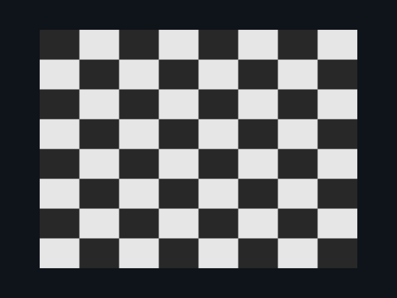
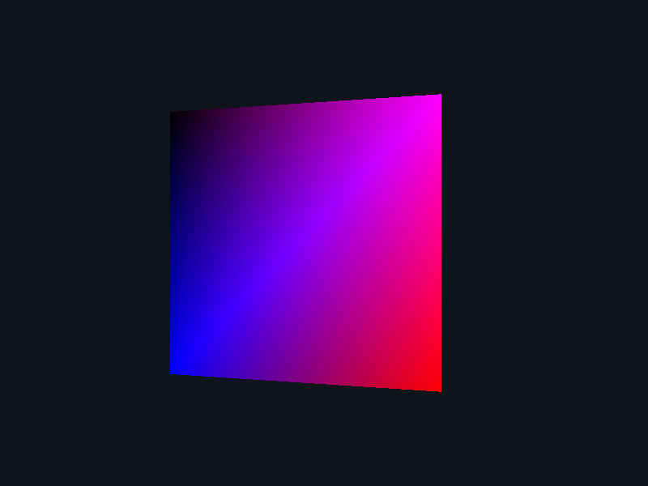
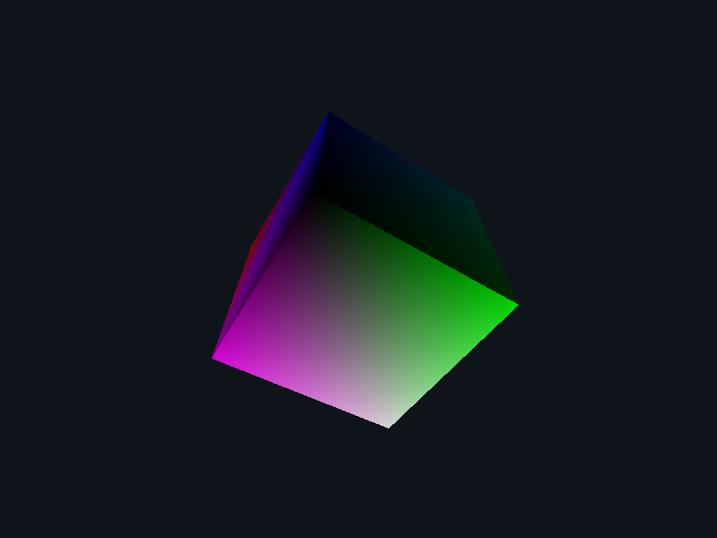

# Learn WebGPU (in parts)

Each segment of learning is tagged (i.e. `step1`), see tags to browse that step.

### Running Server

```bash
npx live-server
```

## Step 1

- Request an adapter and device from WebGPU.
- Configure a canvas context with the preferred texture format.
- Write a minimal WGSL vertex shader using vertex_index to produce positions without buffers.
- Write a fragment shader that outputs a solid color.
- Create a render pipeline and draw inside a render pass.
- Core rendering flow = Device → Pipeline → Pass → Submit.

## Step 2

- Use a GPU vertex buffer for per-vertex data instead of generating positions in the shader.
- Interleave attributes: position (`@location(0) vec2<f32>`) and color (`@location(1) vec3<f32>`).
- Describe the layout via `vertex.buffers` using `arrayStride` and `attributes` offsets.
- Pass the color from vertex to fragment and output it in the fragment shader.
- Bind the vertex buffer with `pass.setVertexBuffer(0, vertexBuffer)` and draw a colored triangle.



## Step 3

- Use a uniform buffer to pass time, aspect ratio, and amplitude to shaders.
- Define a WGSL `Uniforms` struct and read it in the vertex stage via `@group(0) @binding(0)`.
- Animate the triangle by wobbling vertices over time using `sin(time + x)`; drive updates with `requestAnimationFrame`.
- Preserve proportions by scaling x by the canvas aspect in the vertex shader.
- Create a bind group for the uniform buffer and bind it with `pass.setBindGroup(0, bindGroup)`; write new uniform values each frame.
- Leverage `layout: 'auto'` to obtain the bind group layout from the pipeline.



## Step 4

- Introduce an index buffer (`GPUBufferUsage.INDEX`) to reuse vertex data.
- Expand geometry to a rectangle (two triangles) and store indices as `Uint16Array`.
- Switch draw call to `pass.drawIndexed(indexCount)` and bind the index buffer via `pass.setIndexBuffer`.
- Keep the interleaved vertex buffer and pipeline layout the same; only add the index buffer.
- Continue writing uniforms each frame to animate (builds on Step 3).
- Ensure aspect-correct rendering still works after geometry changes.



## Step 5

- Move to 3D: render a colored cube with interleaved attributes — position (`@location(0) vec3<f32>`) and color (`@location(1) vec3<f32>`); draw via an index buffer (36 indices).
- Add a depth buffer: create a `depth24plus` texture, enable `depthWriteEnabled: true` and `depthCompare: 'less'` in the pipeline, and attach the depth target in the render pass.
- Compute an MVP each frame: rotate the model over time, use `lookAt` for the view, and `perspective(aspect)` for projection (WebGPU clip space).
- Store the `mat4x4<f32>` MVP in a uniform buffer bound at `@group(0) @binding(0)` and multiply in the vertex shader.
- Use back-face culling (`cullMode: 'back'`, `frontFace: 'ccw'`) and render with `pass.drawIndexed`.
- Animate with `requestAnimationFrame` for smooth rotation.



## Step 6

- Lambert shading with per-vertex color: interleave position (`@location(0) vec3<f32>`), normal (`@location(1) vec3<f32>`), and color (`@location(2) vec3<f32>`); update the vertex layout (stride = 9 floats).
- Uniforms struct: `mvp: mat4x4<f32>`, `normalMatrix: mat4x4<f32>` (transpose(inverse(model))), and `lightDir: vec3<f32>`; bind at `@group(0) @binding(0)`.
- Compute per-frame matrices: rotate the model over time, build `view = lookAt(...)` and `proj = perspective(aspect, ...)`, then `mvp = proj * view * model`.
- Fragment shader uses Lambert: `N = normalize(n)`, `L = normalize(-lightDir)`, `ndotl = max(dot(N, L), 0)`, final color = `albedo * (0.15 + 0.85 * ndotl)`.
- Enable depth testing (`depth24plus`, `depthWriteEnabled: true`, `depthCompare: 'less'`) and back-face culling (`cullMode: 'back'`, `frontFace: 'ccw'`).
- Draw the indexed cube (`drawIndexed`) and animate with `requestAnimationFrame`.


